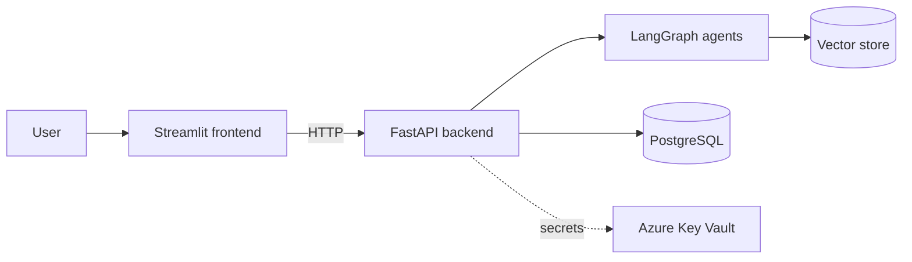

# DocChat Cloud 💬

[](https://github.com/juancasas1996/docchat-cloud/actions/workflows/deploy.yml)
[](https://github.com/juancasas1996/docchat-cloud/actions/workflows/pr-checks.yml)

Agentic RAG chat over documents — built incrementally and deployed to **Azure**
with **GitHub Actions CI/CD**.

The goal: a production-style deployment of a multi-agent RAG system
(FastAPI backend, LangGraph agents, Streamlit frontend, PostgreSQL, Azure
Key Vault), grown phase by phase with working software at every step.

## Architecture (target)



## Roadmap

| Phase | Deliverable | Status |
|-------|-------------|--------|
| 1 | FastAPI + Streamlit running locally with Docker Compose | ✅ |
| 2 | Terraform IaC → Azure Container Apps (images on GHCR) | ✅ |
| 3 | CI/CD with GitHub Actions (OIDC, remote state, plan-on-PR) | ✅ |
| 4 | Secrets in Azure Key Vault via managed identity | ⏳ |
| 5 | PostgreSQL (metadata, history, agent checkpoints) | ⏳ |
| 6 | Agentic RAG pipeline (retriever + research/verify agents) | ⏳ |

## Infrastructure

Everything is Terraform, split in two stacks (see [infra/](infra/)):

- **`infra/bootstrap/`** — run locally once: OIDC federated credentials for
  GitHub Actions (no stored cloud passwords), remote-state Storage Account,
  resource group and a budget guardrail.
- **`infra/environments/dev/`** — managed by CI: `Infra Plan` comments a
  `terraform plan` on every PR; `Infra Apply` applies on merge to `main`.
  App images are deployed by the `CI/CD` workflow on every push.

## Run locally

Requires Docker.

```bash
docker compose up --build
```

- Frontend: <http://localhost:8501>
- API docs: <http://localhost:8000/docs>
- Health check: <http://localhost:8000/health>

## Project layout

```text
├── api/               # FastAPI backend
│   ├── app/main.py
│   └── Dockerfile
├── frontend/          # Streamlit UI
│   ├── streamlit_app.py
│   └── Dockerfile
└── docker-compose.yml
```
