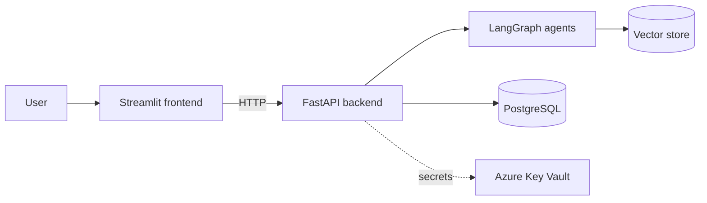

# DocChat Cloud 💬

Agentic RAG chat over documents — built incrementally and deployed to **Azure**
with **GitHub Actions CI/CD**.

The goal: a production-style deployment of a multi-agent RAG system
(FastAPI backend, LangGraph agents, Streamlit frontend, PostgreSQL, Azure
Key Vault), grown phase by phase with working software at every step.

## Architecture (target)



## Roadmap

| Phase | Deliverable | Status |
|-------|-------------|--------|
| 1 | FastAPI + Streamlit running locally with Docker Compose | ✅ |
| 2 | Deployed to Azure Container Apps (images on GHCR) | 🔜 |
| 3 | CI/CD with GitHub Actions (OIDC, no stored passwords) | ⏳ |
| 4 | Secrets in Azure Key Vault via managed identity | ⏳ |
| 5 | PostgreSQL (metadata, history, agent checkpoints) | ⏳ |
| 6 | Agentic RAG pipeline (retriever + research/verify agents) | ⏳ |

## Run locally

Requires Docker.

```bash
docker compose up --build
```

- Frontend: http://localhost:8501
- API docs: http://localhost:8000/docs
- Health check: http://localhost:8000/health

## Project layout

```
├── api/               # FastAPI backend
│   ├── app/main.py
│   └── Dockerfile
├── frontend/          # Streamlit UI
│   ├── streamlit_app.py
│   └── Dockerfile
└── docker-compose.yml
```
